# Firestore ER Diagram — `centralhub-8727b`

Visual companion to [`FIRESTORE_SCHEMA.md`](FIRESTORE_SCHEMA.md). The schema doc is authoritative for fields and rules; this doc is the picture you scan when you want to **see** how things connect.

GitHub renders the Mermaid blocks below as diagrams. In a code editor without Mermaid, install the [Markdown Preview Mermaid Support](https://marketplace.visualstudio.com/items?itemName=bierner.markdown-mermaid) extension or use [mermaid.live](https://mermaid.live).

> **Cardinality notation** (Mermaid):
> `||--o{` = one to many ·
> `||--o|` = one to optional one ·
> `}o--o{` = many to many.
> Lines are labelled with the FK field name on the child side.

---

## 1. Identity Core

The shape every other diagram hangs off. `users` and `partner_schools` are referenced by almost everything else.

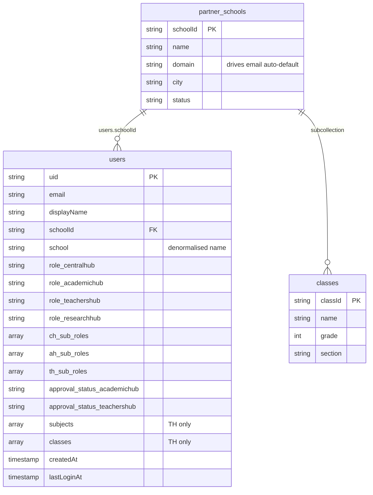

---

## 2. Pacing & Progress

Teachers track their week-by-week progress against admin-managed pacing structures. `userProgress` is the single cumulative doc per teacher; `weekly_progress` is per-week per-teacher per-platform.

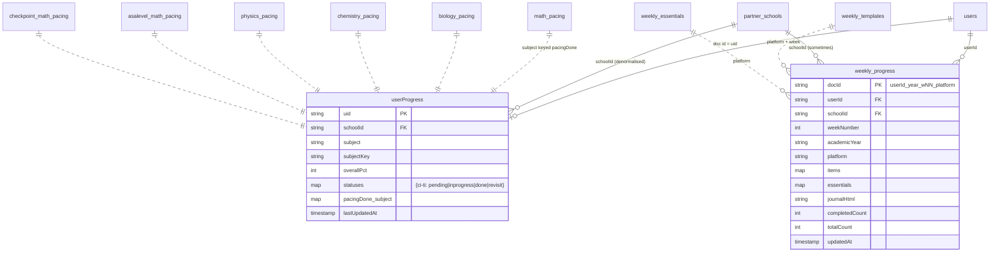

**Key cardinalities:**
- `users 1—1 userProgress` — exactly one cumulative doc per teacher (doc id == uid).
- `users 1—N weekly_progress` — one doc per (week × platform) per teacher.
- The `*_pacing` collections are reference data (one doc per year), each `userProgress.pacingDone_<subject>` is a denormalised slice of the relevant pacing's status.

---

## 3. Appraisals

Three parallel appraisal flows: formal (`teacher_appraisals`), self (`teacher_self_appraisals`), and walkthrough (`teacher_walkthroughs`).

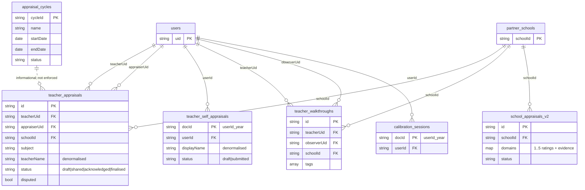

**Notes:**
- `teacher_self_appraisals.docId` follows the pattern `{uid}_{academicYear}` so an evaluator can construct the doc id deterministically and `get` it without a list query.
- `teacher_appraisals.teacherName` is denormalised; refresh policy lives in the schema doc.

---

## 4. KPI System

Two KPI tracks: **school-level** (`kpi_*`, `school_performance_kpi`, `kpi_school_submissions`) and **teacher-level** (`teacher_kpi_*`). They use overlapping config but different submission flows.

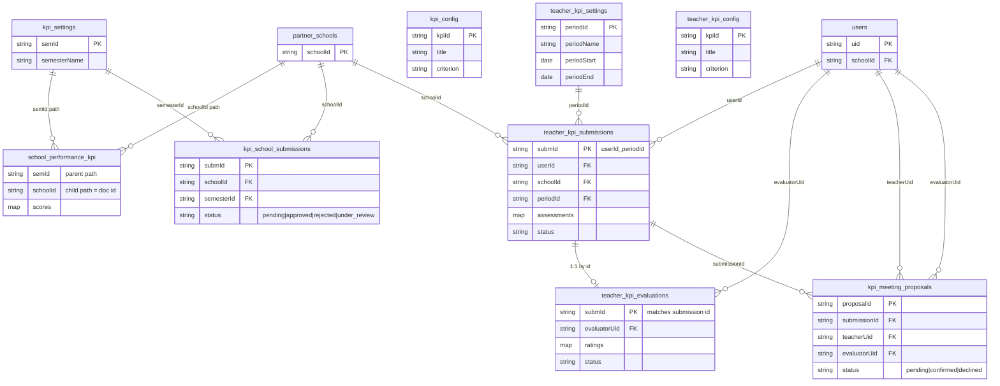

**Critical invariant:** `teacher_kpi_submissions` REQUIRES a `schoolId` field on every write. The Firestore rule rejects writes where `schoolId != userProfile().schoolId`. The composite index `(periodId, schoolId)` is required by the AH evaluator query.

---

## 5. Comms, Surveys, Documents

The flat content collections every user reads.

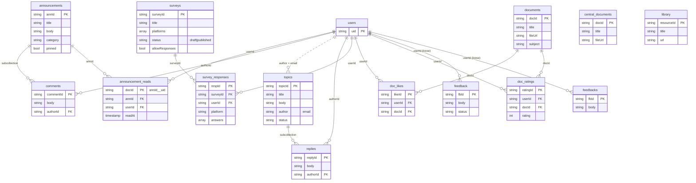

**Note:** `feedback` and `feedbacks` are still two separate collections — see the standardisation backlog.

---

## 6. Configuration & Access Control

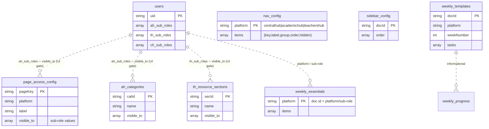

**Note:** All four of these `visible_to`-style references are **client-side filters** today — Firestore rules don't enforce the intersection. See the standardisation backlog.

---

## 7. Cambridge Curriculum (read-only reference)

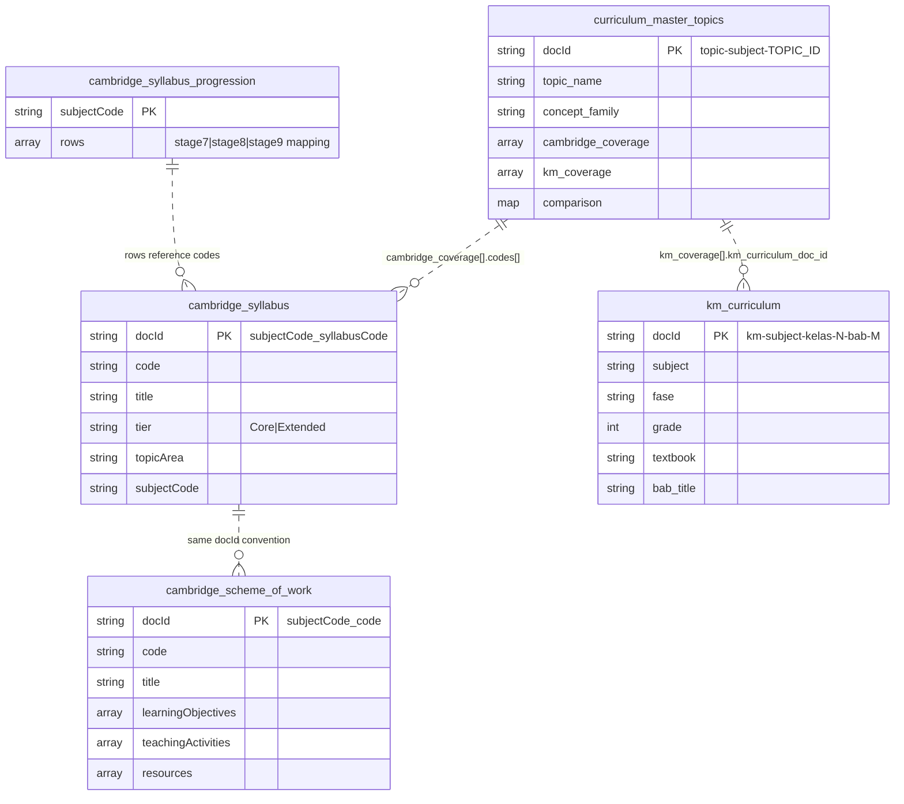

---

## 8. Activities Board

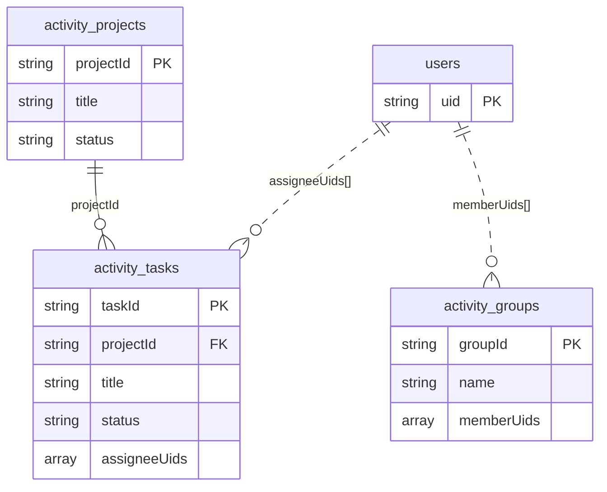

---

## 9. Calendar & Events

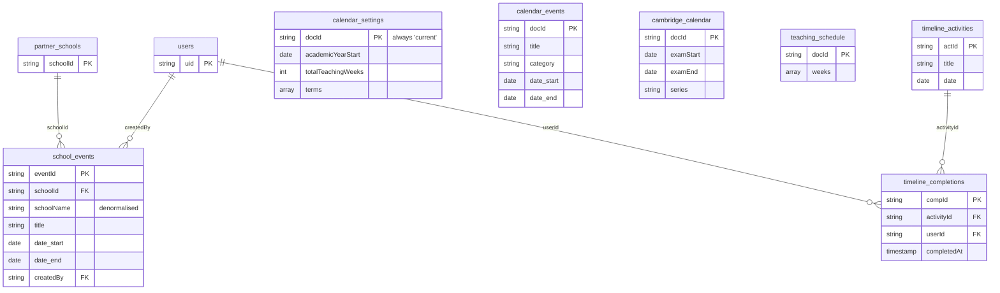

---

## 10. Competency Framework

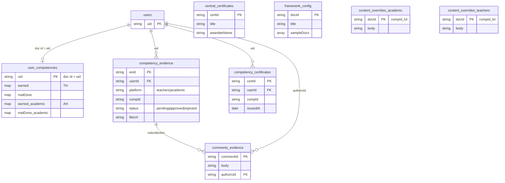

---

## 11. Audit, Recruitment, Misc

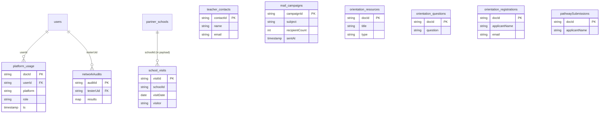

`teacher_contacts`, `mail_campaigns`, `orientation_*`, and `pathwaySubmissions` have no FKs into authenticated users — they are external-prospect data. `mail_campaigns` is written by the Railway mail service via the Admin SDK (bypasses rules).

---

## How to update this diagram

1. **Adding a new collection?**
   - Add a card to [`FIRESTORE_SCHEMA.md`](FIRESTORE_SCHEMA.md) first.
   - Pick the diagram section above that best fits its domain (or add a new one).
   - Use the same `||--o{` / `||..o{` cardinality conventions and label every relationship with the FK field name.
2. **Renaming a field?** Search this file for the old name and update both the entity definition and the relationship label.
3. **Big restructure?** Render the diagrams locally (mermaid.live) before committing — it's easy to introduce syntax errors that GitHub silently fails to render.

---

_Last sync with rules: 2026-05-03_
